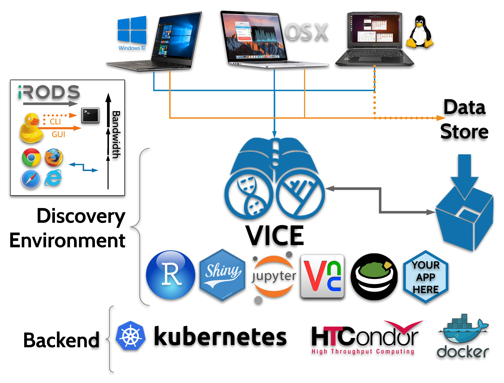

|CyVerse logo|_

|Home_Icon|_
`Learning Center Home <http://learning.cyverse.org/>`_

**About**
---------

What is VICE?
=============
**VICE** stands for **V**\isual **I**\nteractive **C**\omputing **E**\nvironment, and is a component of CyVerse's data science workbench, called the `Discovery Environment (DE) <https://www.cyverse.org/discovery-environment>`_. **VICE** allows users to launch web-based applications from the DE. Once an application is launched, the user can access the **VICE** app through a linked URL, they can bring their data from the `CyVerse Data Store <https://www.cyverse.org/data-store>`_ into the application, or pull data from anywhere on the web using standard requests (``curl`` ``wget`` ``git``).

|VICE diagram|

What is the big idea?
=====================
The CyVerse DE hosts a large number of CLI applications for researchers to perform bioinformatic data analysis. **VICE** introduces graphic user interfaces (GUI) and common Integrated Development Environments (IDE) such as `Project Jupyter Notebooks & Lab <http://jupyter.org/>`_, `Rstudio <https://www.rstudio.com/>`_, and `Shiny Apps <https://shiny.rstudio.com/>`_. 

**VICE** allows exploratory bioinformatic and geoinformatic data analysis as well as the ability to run ad-hoc scripts.

By working on an advanced, scalable, cyberinfrastructure you are essentially moving your algorithms and code to the center where data and compute live. CyVerse operates on an Internet2 backbone, meaning your data are transferred at rates which likely exceed your local ISP or campus network.  

How is it different than other DE apps?
=======================================
The other apps in the DE are non-interactive, meaning, the user selects parameters and data for a particular analysis, and submits the job to CyVerse. When the process completes the user is notified and they can view their analysis results in a folder. 

**VICE** let users interact with their data and do analyses in their favorite programming language.  Researchers can now explore their datasets interactively by easily changing parameters of selected analysis applications without having to download data from storage to an active workspace. 

Conclusion
==========

**VICE** combines the cyberinfrastructure power of CyVerse with the interactivity of modern web-based IDE and data science software, allowing researchers to work seemlessly with their data in a single high performance data science workbench.

----

  |Home_Icon|_
  `Learning Center Home <http://learning.cyverse.org/>`_

.. |CyVerse logo| image:: ./img/cyverse_rgb.png
    :width: 500
    :height: 100    
.. _CyVerse logo: http://learning.cyverse.org/

    
.. |Home_Icon| image:: ./img/homeicon.png
    :width: 25
    :height: 25
.. _Home_Icon: http://learning.cyverse.org/
