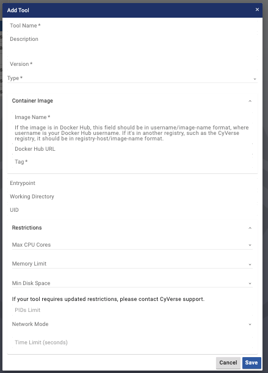
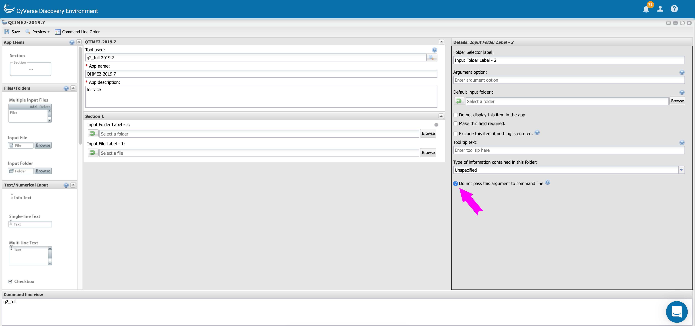

|CyVerse logo|_

|Home_Icon|_
`Learning Center Home <http://learning.cyverse.org/>`_

**Building VICE tools and apps**
--------------------------------

Once you build your Docker image (following the guidelines), the next step is building the VICE tools. For this you'll need a Docker image, port number, User ID and Working directory.

Docker images
===============

The Docker image of your tool is mandatory and it should be available on public registries such as `Dockerhub <https://hub.docker.com>`_ or `quay.io <http://quay.io>`_. Alternatively you can provide us the Dockerfile and we will build the Docker image for you. If there is no Dockerfile for the tool that you are interested in, then tell us what tool you are interesting in making us as VICE app.

Add Tool in DE 
=================

The final step in building the VICE tool is to fill up the "Add Tool" form in DE.

Brifely here are the following steps.

* Log in CyVerse `Discovery Environment <https://de.cyverse.org/de/>`_

* Click on the Apps window and click Manage Tools button on the far right hand side of the window

* Click on Tools button and then finally Add Tools button

You'll see a Add Tool form like this

|add-tools|

- ``Tool name`` is the name of the tool. This will appear in the DE's tool listing dialog. This is mandatory field. Eg. "jupyterlab-circos"

- ``description`` is a brief description of the tool. This will appear in the DE's tool listing dialog. Eg. "Circos is a software package for visualizing data and information that was created by Martin Krzywinski"

- ``version`` is the version of the tool. This will appear in the DE's tool listing dialog. This is mandatory field. Eg. "1.0"

- ``Image name`` is the name of the image specifier minus the image tag. The image must exist on Dockerhub or quay.io. This is mandatory field. E.g "fomightez/circos-vice"

- ``Tag`` is the image tag. If you don't specify the tag, the DE will look for the "latest" tag which is the default tag.

- ``Docker Hub URL`` is the url of the image on the Dockerhub. E.g https://hub.docker.com/r/fomightez/circos-vice

- ``Type`` is the type of Tool. For VICE apps, chose "interactive".

- ``OSG Image Path`` is path of the image on the OSG. You can skip this for interactive tools.

- ``Entrypoint`` is the Entrypoint for your tool. Entrypoint should be present in the Docker image and if not, you should specify it here.

- ``Working Directory`` this is the working directory of the tool and must be filled in with the value you gathered above. E.g /home/jovyan/vice

- ``UID`` is a number and must be filled in with the value you gathered from above. E.g 1000

- ``Max CPU Cores`` is the number of cores for your tool. Eg. 4

- ``Memory Limit`` is the memory for your tool. Eg. 16 GB

- ``Min Disk Space`` is the minimum disk space. Eg. 266 GB

- ``Container Ports`` must be a list of maps with only a single entry. The key in that entry must be container_port and should be filled in with the number value you gathered above.

.. warning:: 

  It is strongly recommended you do not set the `bind to host` as `true` for your added ports when creating a new App**

Creating VICE app for your tool
==================================

To create a new app, follow the instructions in `here <https://wiki.cyverse.org/wiki/display/DEmanual/Designing+the+Interface>`_

.. Important:: 

  For VICE apps, be sure to check the box "Do not pass this argument to the command line" for each option you add (for VICE, this is usually just input files and folders. 
  
  |vice-do-not-pass|
  
  

----

**Fix or improve this documentation:**

- On Github: `Repo link <https://github.com/CyVerse-learning-materials/Visual_Interactive_Computing_Environment/blob/master/developer_guide/building.rst>`_
- Send feedback: `Tutorials@CyVerse.org <Tutorials@CyVerse.org>`_

----

  |Home_Icon|_
  `Learning Center Home <http://learning.cyverse.org/>`_

.. |CyVerse logo| image:: ../img/cyverse_rgb.png
    :width: 500
    :height: 100
.. _CyVerse logo: http://learning.cyverse.org/
.. |Home_Icon| image:: ../img/homeicon.png
    :width: 25
    :height: 25
.. _Home_Icon: http://learning.cyverse.org/

