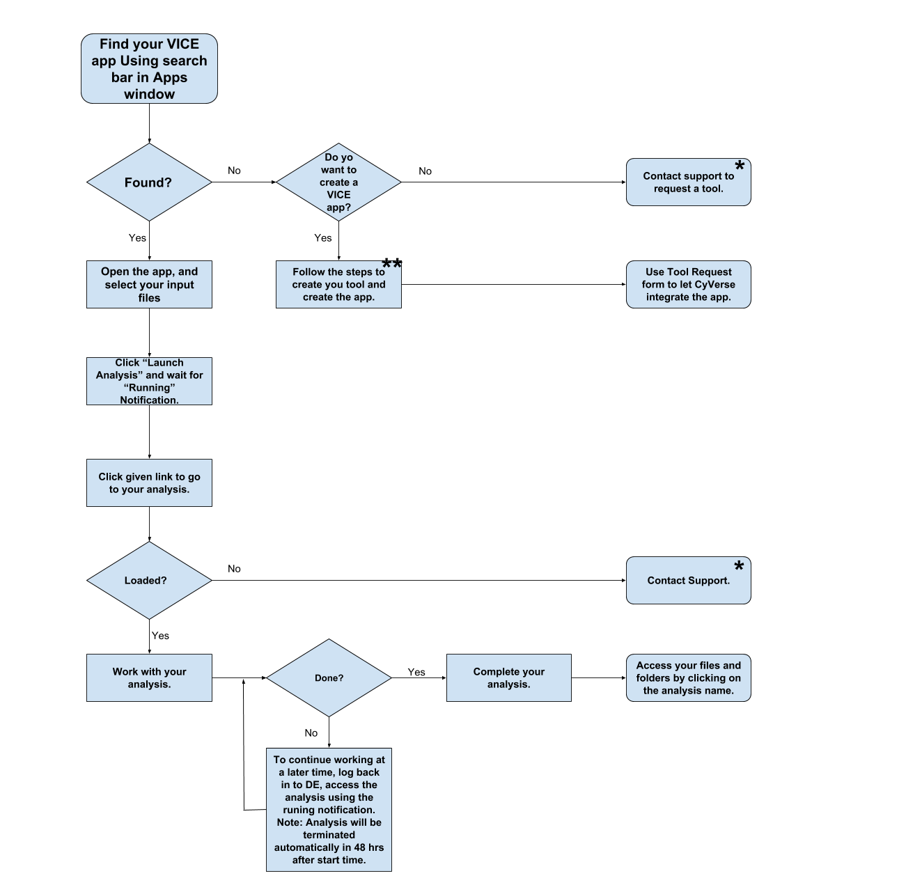

|CyVerse logo|_

|Home_Icon|_
`Learning Center Home <http://learning.cyverse.org/>`_

**Workflow**
------------

|flow|

1. Source code in a github repository

2. Automated build in Dockerhub

An automated build is a Docker image build that is triggered by a code change in a GitHub or Bitbucket repository. By linking a remote code repository to a Dockerhub automated build repository, you can build a new Docker image every time a code change is pushed to your code repository.

A build context is a Dockerfile and any files at a specific location. For an automated build, the build context is a repository containing a Dockerfile.

Automated Builds have several advantages:

Images built in this way are built exactly as specified.
The Dockerfile is available to anyone with access to your Docker Hub repository.
Your repository is kept up-to-date with code changes automatically.
Automated Builds are supported for both public and private repositories on both GitHub and Bitbucket.
2.1 Prerequisites
To use automated builds, you first must have an account on Docker Hub and on the hosted repository provider (GitHub or Bitbucket). While Dockerhub supports linking both GitHub and Bitbucket repositories, here we will use a GitHub repository. If you don’t already have one, make sure you have a GitHub account. A basic account is free

Note

If you have previously linked your Github or Bitbucket account, you must have chosen the Public and Private connection type. To view your current connection settings, log in to Docker Hub and choose Profile > Settings > Linked Accounts & Services.
Building Windows containers is not supported.
2.2 Link your Docker Hub account to GitHub
Log into Docker Hub.
Navigate to Profile > Settings > Linked Accounts & Services.
Click the Link GitHub. The system prompts you to choose between Public and Private and Limited Access. The Public and Private connection type is required if you want to use the Automated Builds.
Press Select under Public and Private connection type. If you are not logged into GitHub, the system prompts you to enter GitHub credentials before prompting you to grant access. After you grant access to your code repository, the system returns you to Docker Hub and the link is complete.
After you grant access to your code repository, the system returns you to Docker Hub and the link is complete. For example, github linked hosted repository looks like this:

3. Create a tool JSON 

----

**Fix or improve this documentation**

- On Github: `Repo link <https://github.com/CyVerse-learning-materials/sciapps_guide>`_
- Send feedback: `Tutorials@CyVerse.org <Tutorials@CyVerse.org>`_

----

|Home_Icon|_
`Learning Center Home <http://learning.cyverse.org/>`_

.. |CyVerse logo| image:: ../img/cyverse_rgb.png
    :width: 500
    :height: 100
.. _CyVerse logo: http://learning.cyverse.org/
.. |Home_Icon| image:: ../img/homeicon.png
    :width: 25
    :height: 25
.. _Home_Icon: http://learning.cyverse.org/
