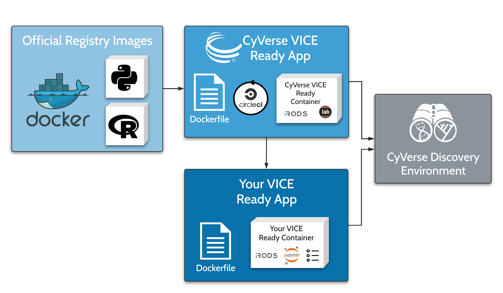

|CyVerse logo|_

|Home_Icon|_
`Learning Center Home <http://learning.cyverse.org/>`_

**Workflow**
------------

CyVerse hosts many popular data science applications, e.g. Jupyter Lab, RStudio, and Shiny. These applications can be started in the Discovery Environment, and the researcher can install additional packages to the running application.

In cases where the installation may be complex, long, or require additional system administrator level access, the researcher can use the existing CyVerse container as a base image for their own new container. The researcher can add their own packages and then deploy the new app in the Discovery Environment. 

|flow|

----

**Fix or improve this documentation**

- On Github: `Repo link <https://github.com/CyVerse-learning-materials/sciapps_guide>`_
- Send feedback: `Tutorials@CyVerse.org <Tutorials@CyVerse.org>`_

----

|Home_Icon|_
`Learning Center Home <http://learning.cyverse.org/>`_

.. |CyVerse logo| image:: ../img/cyverse_rgb.png
    :width: 500
    :height: 100
.. _CyVerse logo: http://learning.cyverse.org/
.. |Home_Icon| image:: ../img/homeicon.png
    :width: 25
    :height: 25
.. _Home_Icon: http://learning.cyverse.org/

