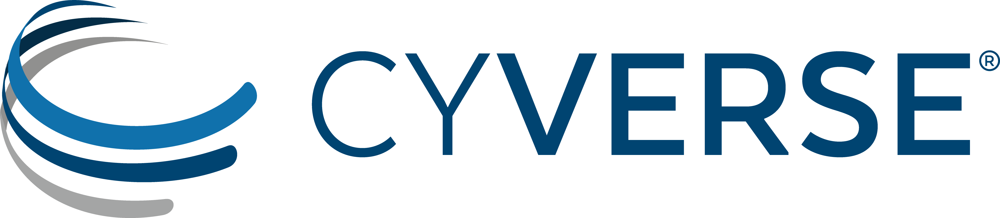

|CyVerse_logo|_

|Home_Icon|_
`Learning Center Home <http://learning.cyverse.org/>`_

**Frequently Asked Questions**
------------------------------

1. What happens if my VICE app has been running for more than 48 hours?

2. Can I extend the 48hr time limit on the VICE app?

3. Can I request the CyVerse team to build the VICE app for my interactive tool if I don't have Docker image?

4. I'm getting this error (or similar) with my docker file:
You must set a unique PASSWORD (not 'rstudio') first! e.g. run with: docker run -e PASSWORD=<YOUR_PASS> -p 8787:8787 rocker/rstudio

How do I pass a password into the dockerfile when the container is launched?  This is a frequent problem with the rocker image for rStudio: https://hub.docker.com/r/rocker/rstudio/

A: Trying using this base image for rStudio: `cyversevice/rstudio-base:latest` or `cyversevice/rstudio-verse:3.6.0` rather than rocker/rstudio.  For bioconductor images, use `upendradevisetty/bioconductor:1.0`

----

**Fix or improve this documentation:**

- On Github: `Repo link <https://github.com/CyVerse-learning-materials/sciapps_guide>`_
- Send feedback: `Tutorials@CyVerse.org <Tutorials@CyVerse.org>`_

----

  |Home_Icon|_
  `Learning Center Home <http://learning.cyverse.org/>`_

.. _CyVerse_logo: https://cyverse.org/

.. |Home_Icon| image:: ../img/homeicon.png
    :width: 25
    :height: 25
.. _Home_Icon: http://learning.cyverse.org/
