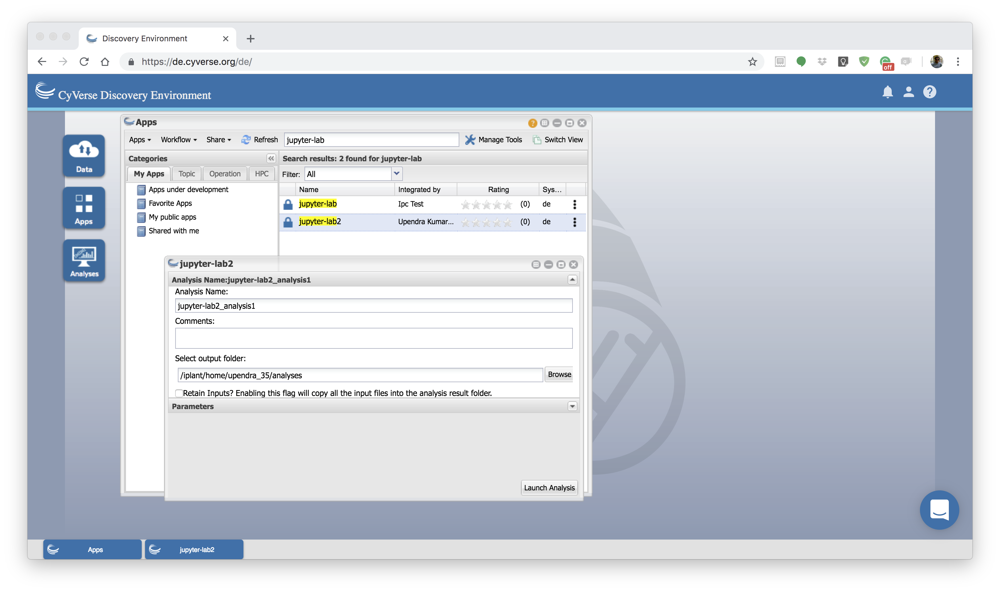
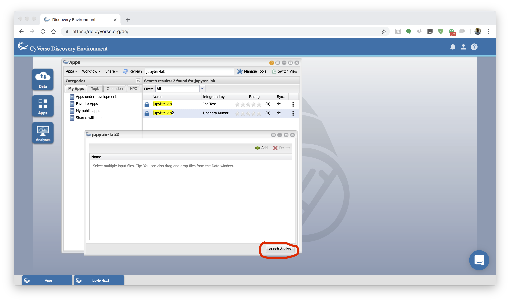

|CyVerse logo|_

|Home_Icon|_
`Learning Center Home <http://learning.cyverse.org/>`_

**Jupyter Lab app quick launch**
--------------------------------
Jupyter Notebook is an incredibly powerful tool for interactively developing and presenting data science projects. A Jupyter notebook integrates code and its output into a single document that combines visualisations, narrative text, mathematical equations, and other rich media. The intuitive workflow promotes iterative and rapid development, making notebooks an increasingly popular choice at the heart of contemporary data science, analysis, and increasingly, science at large.

1. Running Jupyter Lab
======================

First log-on `CyVerse DE <https://de.cyverse.org/de/>`_, open the Apps window and find the Jupyter Lab app by searching for `Jupyter Lab`. 

|jupyter1-1|

2. Launch analysis
==================

Launch the Jupyter-Lab app by clicking launch analysis

|jupyter1-2|

|jupyter1-3|

3. Navigate to Jupyter-Lab url
==============================

After the analysis starts running, click on the "Access your running Analysis here url"

|jupyter1-4|

4. Launch Jupyter Notebook
==========================

In the new URL, click on Python 3 under Notebook section which will open a new Jupyter notebook

|jupyter1-5|

5. Write your code
==================

In the Jupyter Notebook, you can write your code, generate plots, save plots etc.

|jupyter1-6|

6. Cancel your analysis
=======================

Cancel your analysis by clicking the Analysis window, then select the Rshiny analysis and click Cancel Analysis option under "Analyses" button

|jupyter1-7|

|jupyter1-8|

**Fix or improve this documentation**

- On Github: `Repo link <https://github.com/CyVerse-learning-materials/sciapps_guide>`_
- Send feedback: `Tutorials@CyVerse.org <Tutorials@CyVerse.org>`_

----

|Home_Icon|_
`Learning Center Home <http://learning.cyverse.org/>`_

.. |CyVerse logo| image:: ./img/cyverse_rgb.png
    :width: 500
    :height: 100
.. _CyVerse logo: http://learning.cyverse.org/
.. |Home_Icon| image:: ./img/homeicon.png
    :width: 25
    :height: 25

.. |jupyter1-4| image:: ./img/vice/jupyter/jupyter1-4.png
	:width: 700
	:height: 400
.. |jupyter1-5| image:: ./img/vice/jupyter/jupyter1-5.png
	:width: 700
	:height: 400
.. |jupyter1-6| image:: ./img/vice/jupyter/jupyter1-6.png
	:width: 700
	:height: 400

.. |jupyter1-8| image:: ./img/vice/jupyter/jupyter1-8.png
	:width: 700
	:height: 400
.. _Home_Icon: http://learning.cyverse.org/
