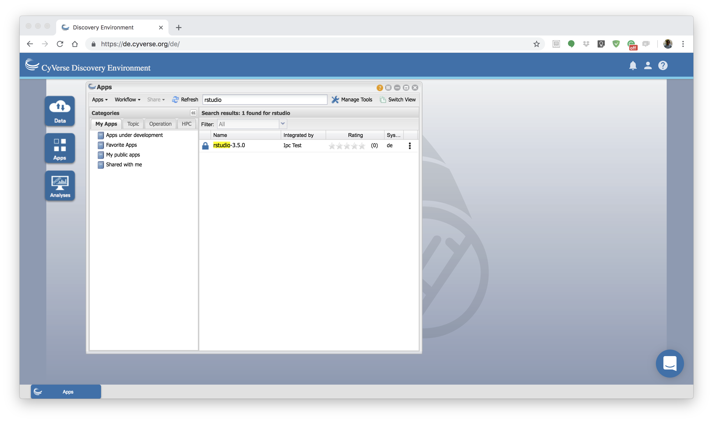
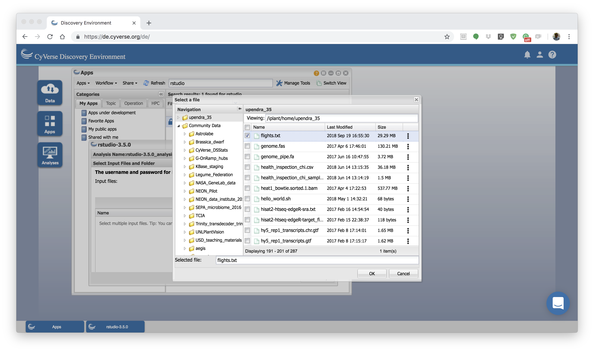
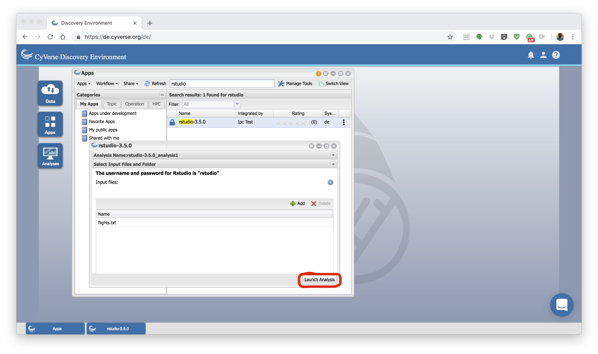
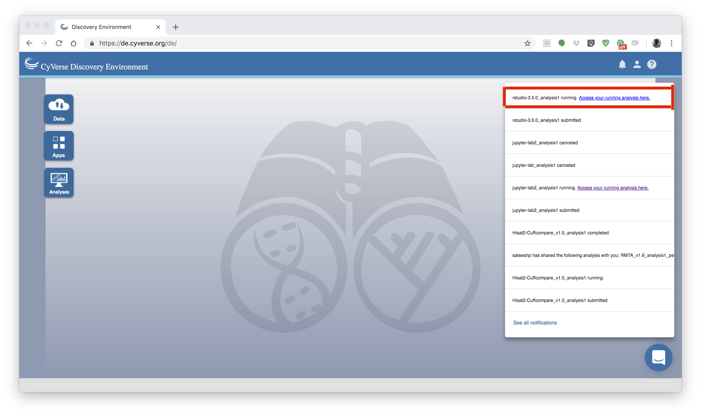
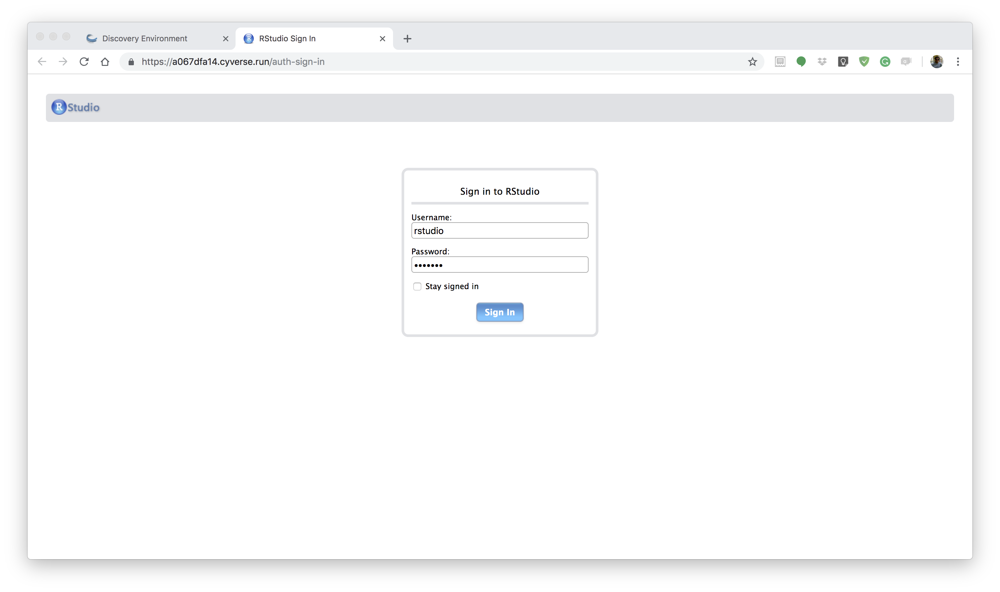
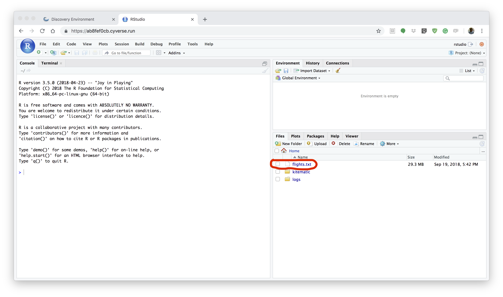
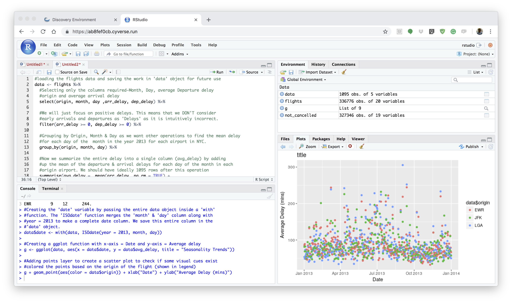
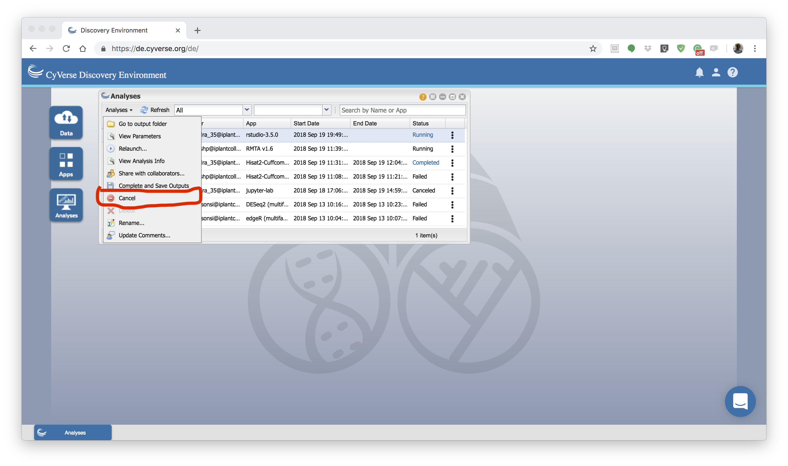

|CyVerse logo|_

|Home_Icon|_
`Learning Center Home <http://learning.cyverse.org/>`_

**Rstudio App quick launch**
-----------------------------
Rstudio is a free, open source IDE (integrated development environment) for R. Its interface is organized so that the user can clearly view graphs, data table, R code and ouput at the same time. It also offers an Import-Wizard-like feature that allows users to import CSV, Excel, SAS (*.sas7bdat), SPSS (*.sav), and Stata (*.dta) files into R without having to write the code to do so.

1. Running Rstudio App
======================

First log-on `CyVerse DE <https://de.cyverse.org/de/>`_, open the Apps window and find the Rstudio Lab app by searching for `rstudio`. 

|rstudio1-1|

2. Launch analysis
==================

Launch the Rstudio app by selecting an example folder and then clicking launch analysis

|rstudio1-2|

|rstudio1-2.5|

3. Navigate to rstudio app url
==============================

After the analysis starts running, click on the "Access your running Analysis here url"

|rstudio1-3|

4. Launch Rstudio
=================

In the new URL, enter `rstudio` for both username and password

|rstudio1-4|

5. Write/Run your code
======================

In the Rstudio script section, you can write your code, generate plots, save plots etc.

|rstudio1-5|

|rstudio1-6|

6. Cancel your analysis
=======================

Cancel your analysis by clicking the Analysis window, then select the Rshiny analysis and click Cancel Analysis option under "Analyses" button

|rstudio1-7|

----

**Fix or improve this documentation**

- On Github: `Repo link <https://github.com/CyVerse-learning-materials/sciapps_guide>`_
- Send feedback: `Tutorials@CyVerse.org <Tutorials@CyVerse.org>`_

----

|Home_Icon|_
`Learning Center Home <http://learning.cyverse.org/>`_

.. |CyVerse logo| image:: ./img/cyverse_rgb.png
    :width: 500
    :height: 100
.. _CyVerse logo: http://learning.cyverse.org/
.. |Home_Icon| image:: ./img/homeicon.png
    :width: 25
    :height: 25

.. _Home_Icon: http://learning.cyverse.org/
