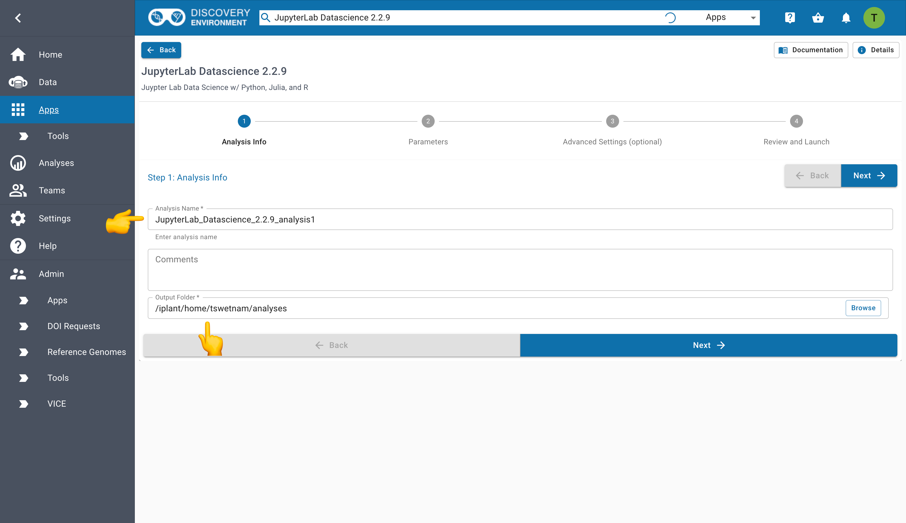

|CyVerse logo|_

|Home_Icon|_
`Learning Center Home <http://learning.cyverse.org/>`_

**Starting JupyterLab App**
---------------------------

First log-in `CyVerse DE <https://de.cyverse.org/de/>`_

1. Search JupyterLab App
========================

After you login to DE, open the Apps window and search the JupyterLab with key word `Jupyter` or `JupyterLab`.

|jupyter2-1|

2. Launch analysis
==================

Launch the JupyterLab app by clicking **launch analysis**. Before you launch, you can either drag and drop or browse the files that you want to use with Jupyter-lab. There is currently no restriction of how many files and size of the files that can be launched along with JupyterLab app.

.. Note::
	The input files and/or folders can be selected under the 'Parameters' tab.

.. Tip::
	If you have a working jupyter workbook, you can import it into the app using input files and/or folder.

|jupyter2-2|

3. Navigate to JupyterLab url
==============================

Unlike regular DE apps once the analysis starts running you will get an url. Click on your notifications, and then by clicking on the "Access your running Analysis here" url (check that it is the jupyter app) you will be redirect to a page with a welcome message.

|jupyter2-3|

|jupyter2-4|

.. Important::
	The app might take a little bit to get everything set up. In the meantime you will see the welcome page.
	You will be automatically redirected to the app from the welcome page after it finishes setting up.

**The JupyterLab Interface:** JupyterLab provides flexible building blocks for interactive, exploratory computing. While JupyterLab has many features found in traditional integrated development environments (IDEs), it remains focused on interactive, exploratory computing. The JupyterLab interface consists of a main work area containing tabs of documents and activities, a collapsible left sidebar, and a menu bar. The left sidebar contains a file browser, the list of running kernels and terminals, the command palette, the notebook cell tools inspector, and the tabs list.

More information about the JupyterLab can be found `here <https://jupyterlab.readthedocs.io/en/stable/user/interface.html>`_.

4. Create Jupyter notebook
==========================

Jupyter notebooks are documents that combine live runnable code with narrative text (Markdown), equations (LaTeX), images, interactive visualizations and other rich output. Jupyter notebooks (.ipynb files) are fully supported in JupyterLab.

If you want to create a notebook, you can do so by clicking the ``+`` button in the file browser and then selecting a kernel in the new Launcher tab. Currently there are 3 different notebooks available - Python3, Julia and R. Click on `Python 3` under Notebook section in the JupyterLab Interface, which will open a new Jupyter Notebook. A new file is created with a default name. Rename a file by right-clicking on its name in the file browser and selecting “Rename” from the context menu.

To know more about notebooks in JupyterLab click `here <https://jupyterlab.readthedocs.io/en/stable/user/notebook.html>`_

.. Tip::

	To open the classic Notebook from JupyterLab, select “Launch Classic Notebook” from the JupyterLab Help menu.

|jupyter2-5|

.. Note::

	There are plenty other cool stuff that you can do in JupyterLab such as using `consoles <https://jupyterlab.readthedocs.io/en/stable/user/code_console.html>`_, using `terminal <https://jupyterlab.readthedocs.io/en/stable/user/terminal.html>`_ and using `text editor <https://jupyterlab.readthedocs.io/en/stable/user/file_editor.html>`_.

5. Write your code
==================

Once you open a new notebook, you can start writing your code, put markdown text, generate plots, save plots etc.

|jupyter2-6|

6. Complete and Save Outputs
===========================

After finishing your analysis, you can save outputs to data store by clicking the Analysis window, then select the VICE analysis that you are running and select `Complete and Save Outputs` under the "Analyses" button.

|jupyter2-7|

After you had done this, you can find the outputs that you generated (if any) using the same steps as before, but this time selecting 'Go To Output Folder'.

.. Warning::
	Currently, VICE can run for 48 hrs beyond which the apps will be terminated. If you have opted for email notifications from DE, then you'll get a notification 1 day before and 1 hour before the app gets terminated. If you want to extend the time, you need to login to http://cyverse.run, find your analysis and then click the hour glass which automatically extends the app run time to 3 more days.

**Fix or improve this documentation**

- On Github: `Repo link <https://github.com/CyVerse-learning-materials/sciapps_guide>`_
- Send feedback: `Tutorials@CyVerse.org <Tutorials@CyVerse.org>`_

7. Jupyter-lab with SQL
=======================

Now you can run SQL queries inside a Jupyter-lab notebook. Here is a quick launch 

.. raw:: html

	

----

|Home_Icon|_
`Learning Center Home <http://learning.cyverse.org/>`_

.. |CyVerse logo| image:: ../img/cyverse_rgb.png
    :width: 500
    :height: 100
.. _CyVerse logo: http://learning.cyverse.org/
.. |Home_Icon| image:: ../img/homeicon.png
    :width: 25
    :height: 25

.. |jupyter2-4| image:: ../img/vice/jupyter/jupyter2-4.png
	:width: 700
	:height: 400

.. _Home_Icon: http://learning.cyverse.org/
