|CyVerse logo|_

|Home_Icon|_
`Learning Center Home <http://learning.cyverse.org/>`_

**Starting Shiny App**
----------------------

Shiny is an R-based web application for interactive data analysis, exploration and visualization. It was built to execute R code dynamically based on user input. Since most JavaScript code is autogenerated by the environment, basic R scripting knowledge is sufficient for Shiny apps.

For running a Shiny App in CyVerse Discovery Environment, you need `app.R` script/file. The following are steps for running an example Rshiny App (`mpg`) that is available on the Rstudio site within the Discovery Environment.

1. Find your Rshiny app
========================

Navigate to `Rstudio github <https://github.com/rstudio/shiny-examples>`_ to find the Rshiny app that you are interested in. Here is an example of one such Rshiny app that we will be using to run in the DE.

|shiny1-1|

2. Find the `app.R` script
==========================

Inside the folder for `mpg` you will find the `app.R` file. Click on the `Raw` button and then copy the contents of the `app.R` file

|shiny1-2|

3. Log-in to CyVerse DE
=======================

Next, login to `CyVerse DE <http://de.cyverse.org>`_. Click on the `Data` window and create a folder `rshiny-mpg` specific for the app

|shiny1-3|

|shiny1-4|

4. Create new `app.R` script in DE
==================================

Under File menu, click the New R Script `app.R`, paste the contents and name it as `app.R`

|shiny1-5|

|shiny1-6|

5. Search Rshiny app
====================

The Rshiny app can be launched by first searching for `Rshiny` app in the search bar in the Apps window

|shiny1-7|

6. Select the `app.R` script
============================

Under Input files of the app, click the "add" button and then select the `app.R` file that you created earlier

|shiny1-8|

7. Launch Rshiny App
====================

After you select the `app.R` file, launch the Rshiny app by clicking launch analysis

|shiny1-9|

8. Navigate to Rshiny url
=========================

After the analysis starts running, click on the "Access your running Analysis here url"

|shiny1-10|

|shiny1-11|

9. Cancel your analysis
=======================

Cancel your analysis by clicking the Analysis window, then select the Rshiny analysis and click Cancel Analysis option under "Analyses" button

|shiny1-12|

|shiny1-13|

References/Tutorials
====================

- Tutorial for those new to Shiny - https://bims.fun/r-shiny.html#fn1
- Collection of posts covering the basics of layout, reactivity and extensions for Shiny - https://bims.fun/r-shiny.html#fn2
- RStudio ‘cheatsheet’ for Shiny - https://bims.fun/r-shiny.html#fn3
- R-Bloggers articles featuring Shiny apps - https://bims.fun/r-shiny.html#fn4
- RStudio webinar slides for getting started with Shiny - https://bims.fun/r-shiny.html#fn5

----

**Fix or improve this documentation:**

- On Github: `Repo link <https://github.com/CyVerse-learning-materials/sciapps_guide>`_
- Send feedback: `Tutorials@CyVerse.org <Tutorials@CyVerse.org>`_

----

  |Home_Icon|_
  `Learning Center Home <http://learning.cyverse.org/>`_

.. |CyVerse logo| image:: ../img/cyverse_rgb.png
    :width: 500
    :height: 100
.. _CyVerse logo: http://learning.cyverse.org/
.. |Home_Icon| image:: ../img/homeicon.png
    :width: 25
    :height: 25
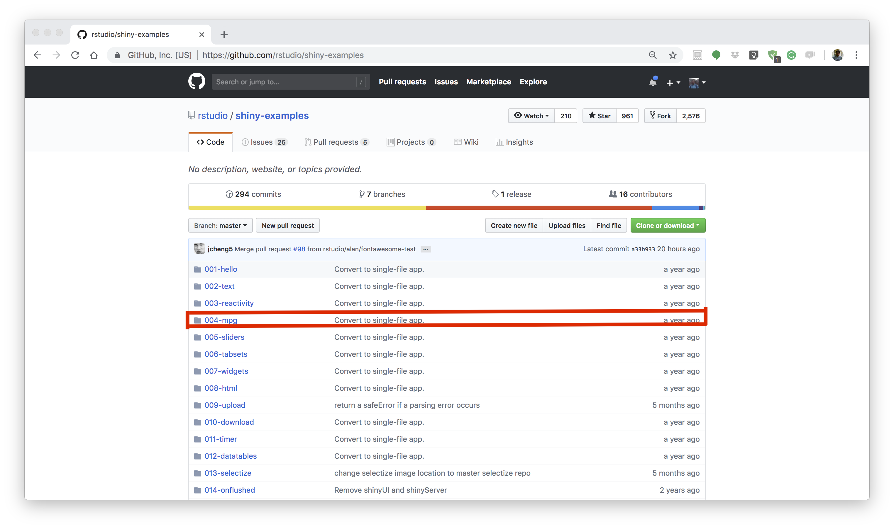
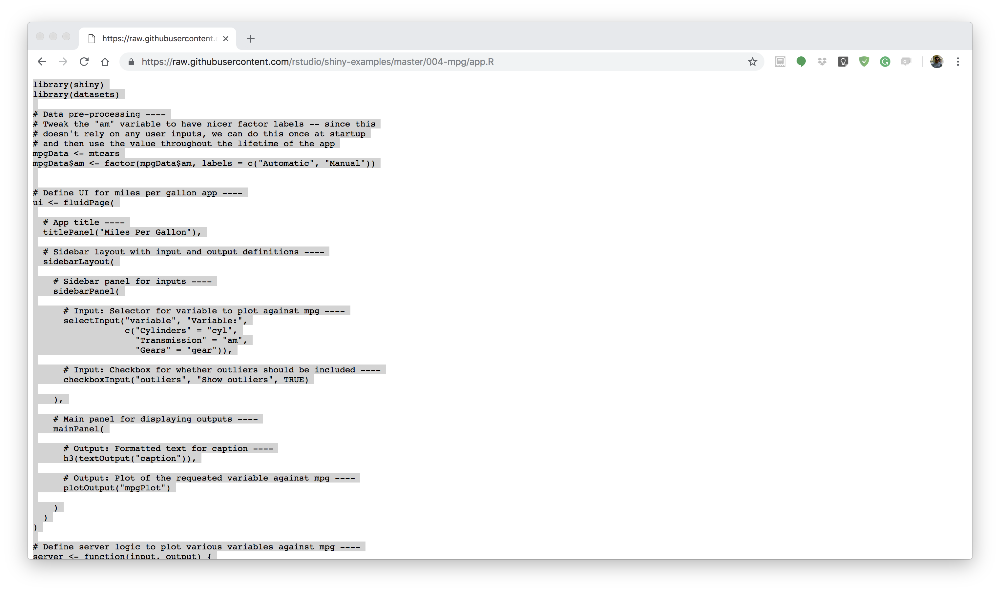
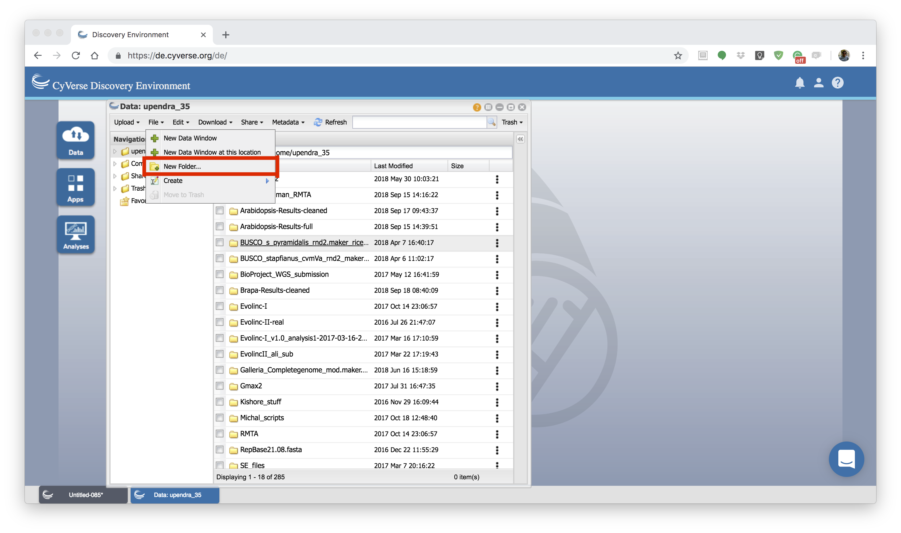
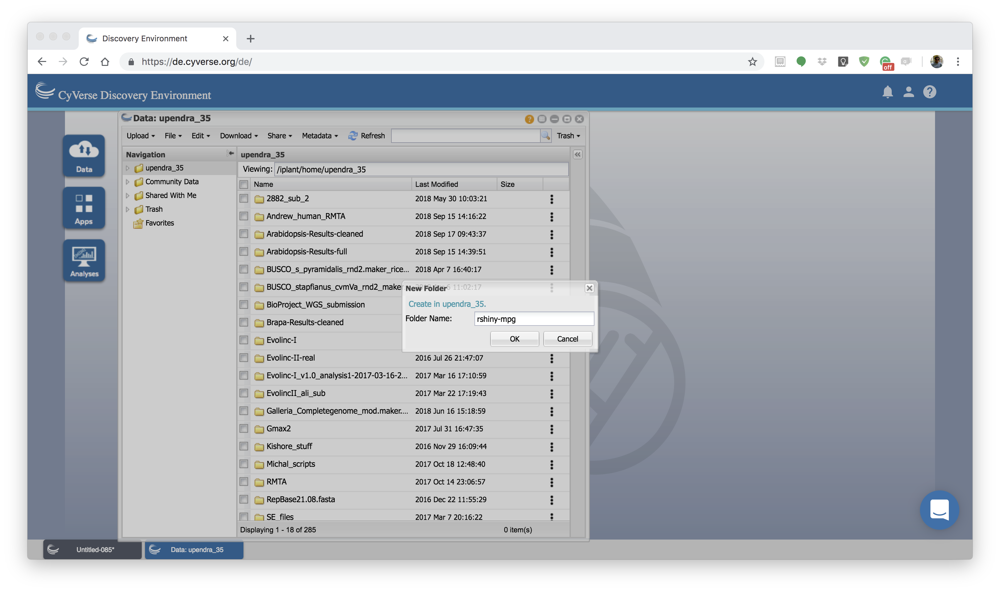
.. |shiny1-5| image:: ../img/vice/shiny/shiny1-5.png
	:width: 700
	:height: 400
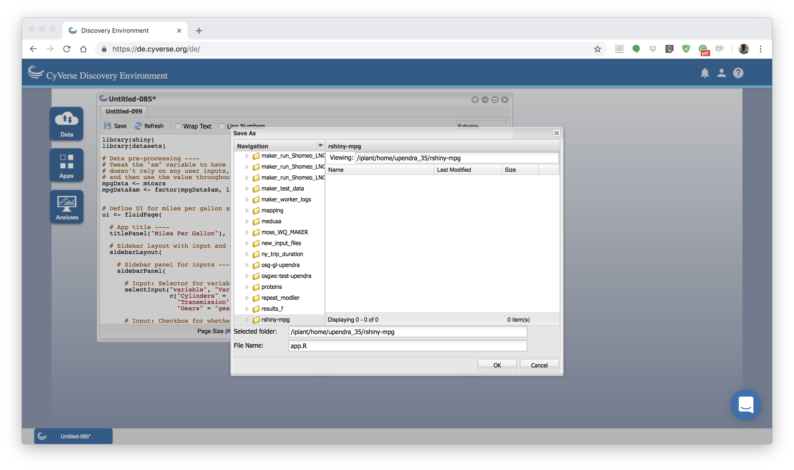
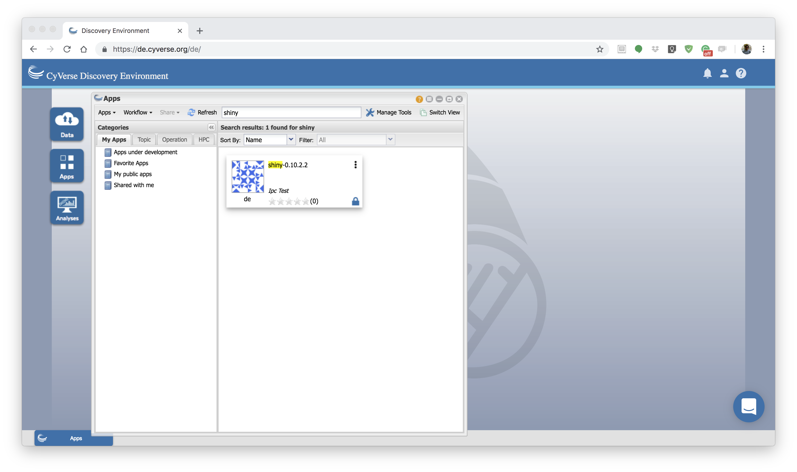
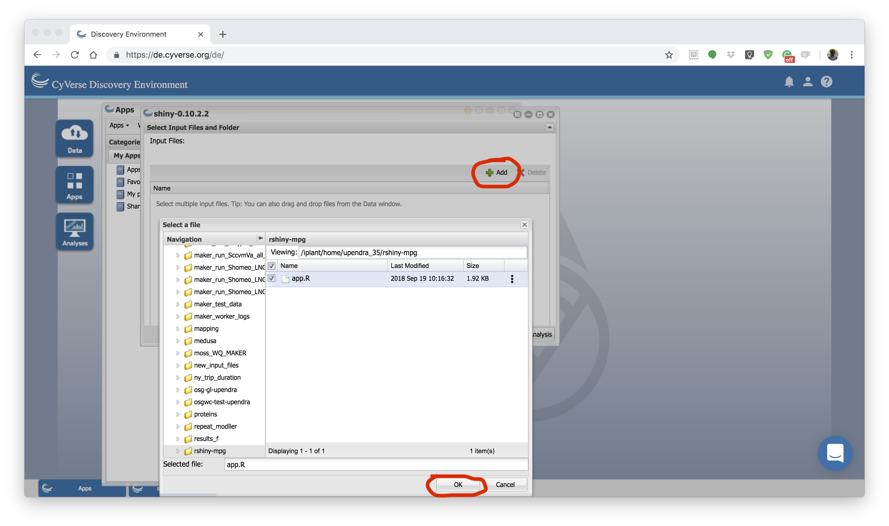
.. |shiny1-9| image:: ../img/vice/shiny/shiny1-9.png
	:width: 700
	:height: 400
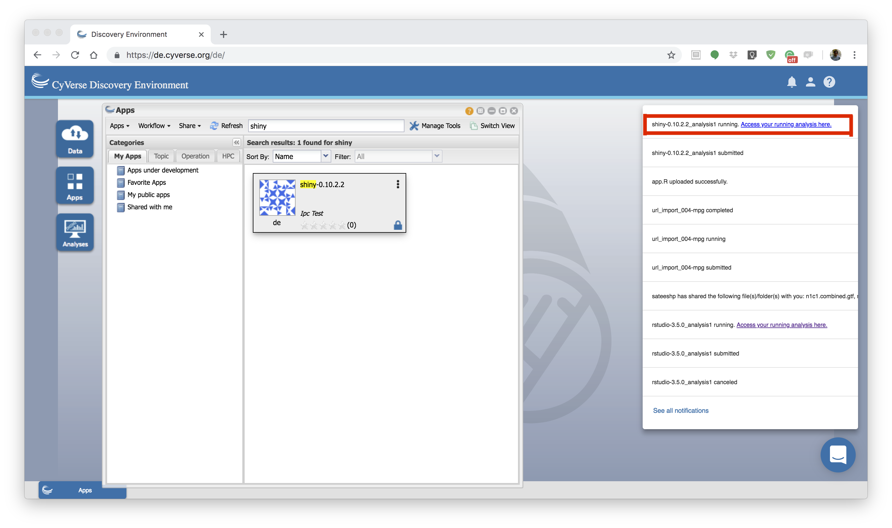
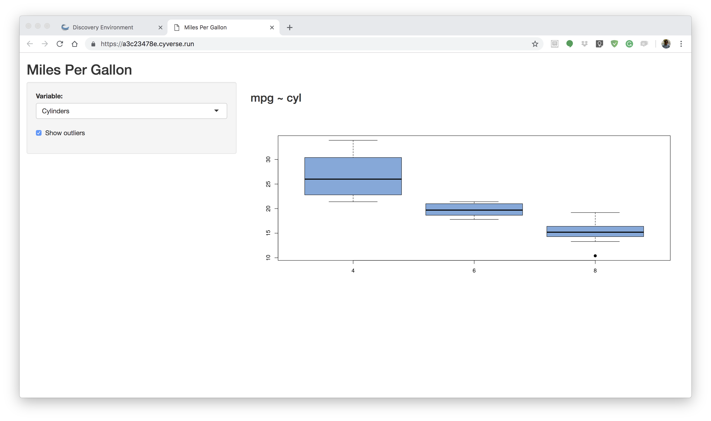
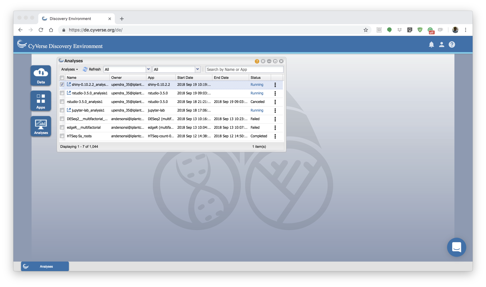
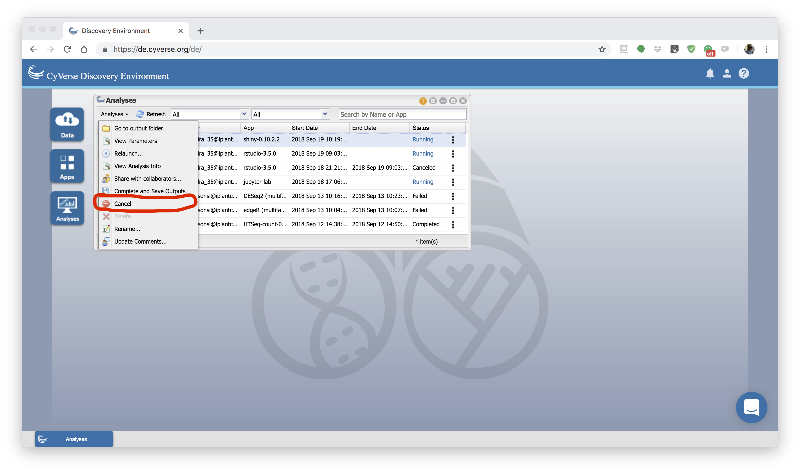
.. _Home_Icon: http://learning.cyverse.org/
