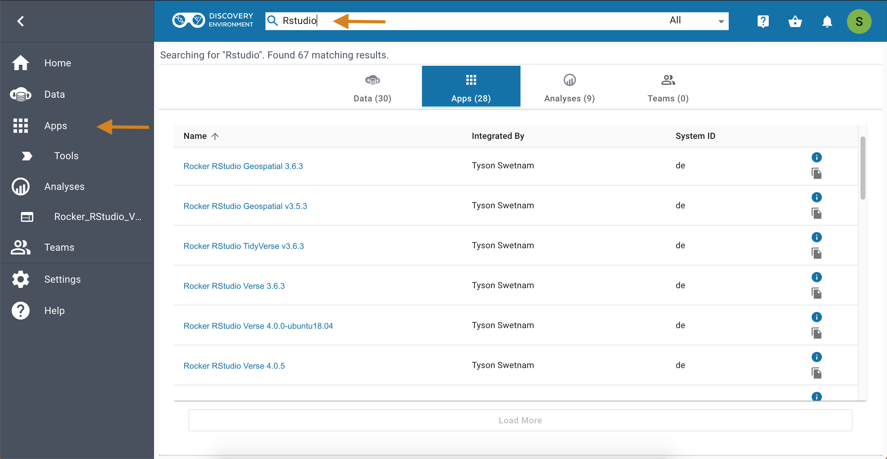
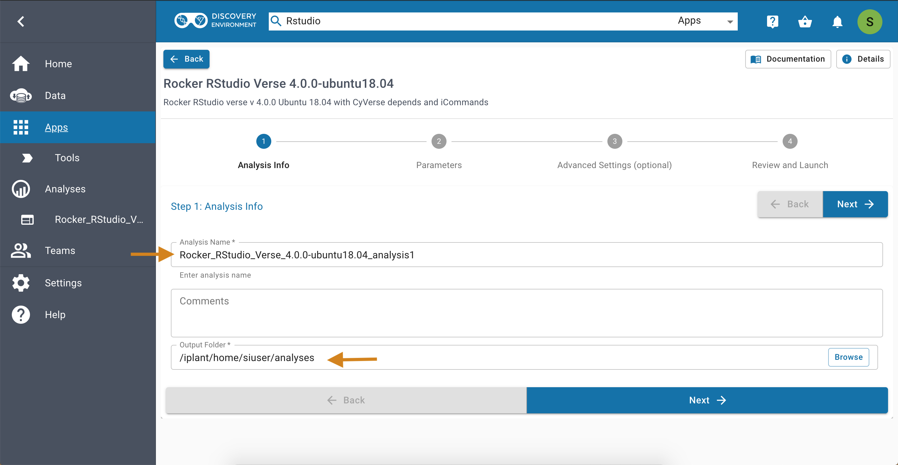
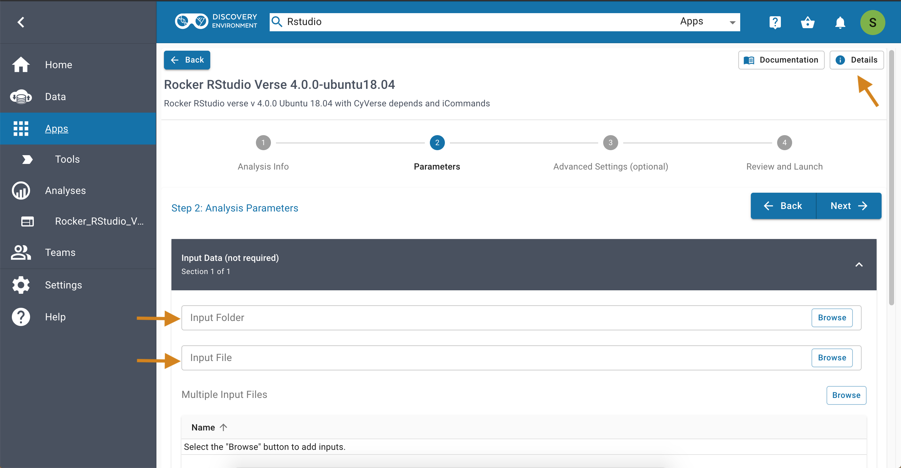
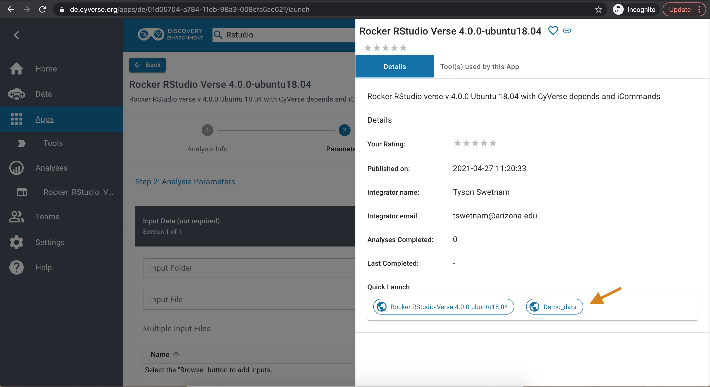
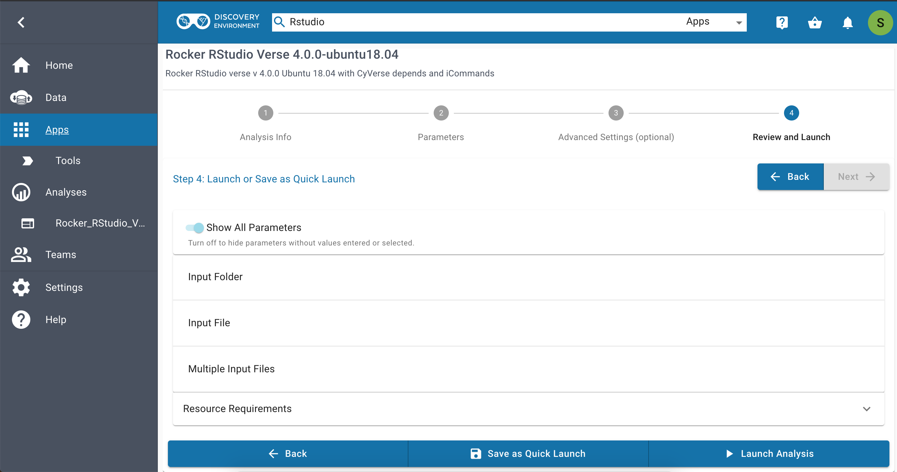
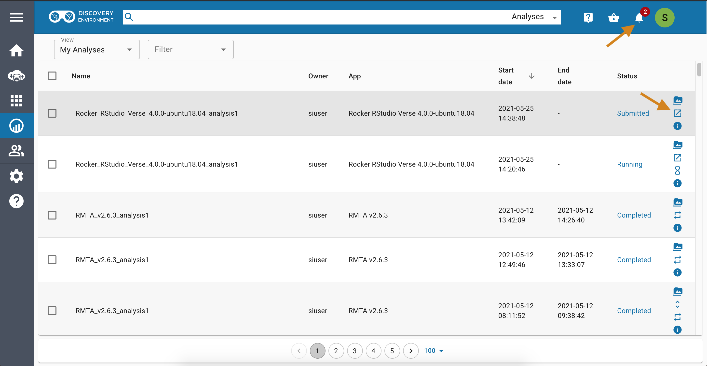
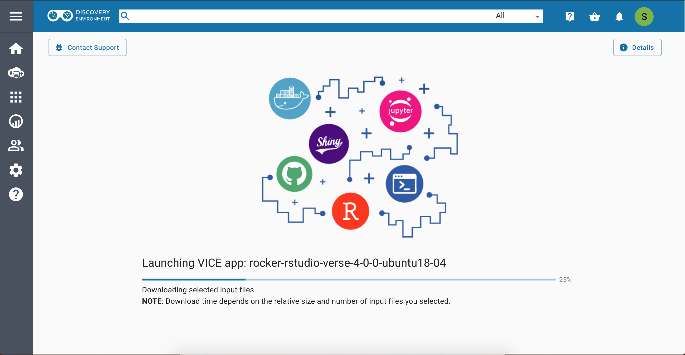
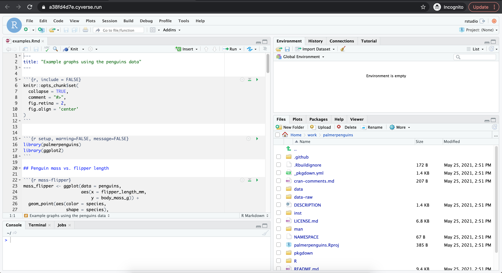
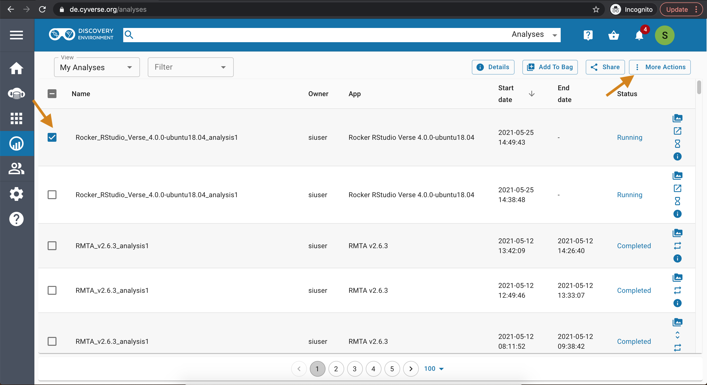
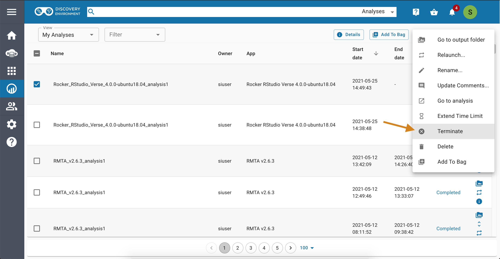

|CyVerse logo|_

|Home_Icon|_
`Learning Center Home <http://learning.cyverse.org/>`_

**Starting RStudio App**
------------------------
RStudio is a free, open source IDE (integrated development environment) for R. Its interface is organized so that the user can clearly view graphs, data table, R code and ouput at the same time. It also offers an Import-Wizard-like feature that allows users to import CSV, Excel, SAS (*.sas7bdat), SPSS (*.sav), and Stata (*.dta) files into R without having to write the code to do so.

1. Running Rstudio App
======================

First log-on `CyVerse DE <https://de.cyverse.org/de/>`_, open the Apps window and find the Rstudio Lab app by searching for '*rstudio*'.

|rstudio3-1|

|rstudio3-2|

2. Launch analysis
==================

Launch the Rstudio app by selecting an example folder and then clicking launch analysis. You can select different input files and/or folder.

.. Tip::
  You can use input files to import a script into the app.

*To use a file as an input...*
|rstudio3-3|

*To use a folder as an input...*
|rstudio3-4|

.. Note::
  You will not see any files when selecting the folder if you selected input by folder. Rest assured that they will be there once the app begins to run.

Launch the analysis after you are finished selecting the input files (if any).
|rstudio3-5|

3. Navigate to rstudio app url
==============================

After the analysis starts running, open your notifications and click on the '*Access your running Analysis here url*'.

|rstudio3-6|

4. Launch Rstudio
=================

In the new URL, enter '*rstudio*' for both username and password

|rstudio3-7|

5. Write/Run your code
======================

In the Rstudio script section, you can write your code, generate plots, save plots etc.

.. Tip::
  As a first step, check that the files you wanted to import are in the app. Go to the bottom right of the app, and check under '*Files*' for your files.

|rstudio3-8|

|rstudio3-9|

6. Complete your analysis
=======================

Complete your analysis by clicking the Analysis window, then select the rstudio analysis and click '*Complete and Save Outputs*' option under "Analyses" button.

|rstudio3-10|

After you had done this, you can find the outputs that you generated (if any) using the same steps as before, but this time selecting '*Go To Output Folder*'.

.. Warning::

	Currently, VICE can run for 48 hrs beyond which the apps will be terminated. So make sure you run your analysis before 48 hrs.
----

**Fix or improve this documentation**

- On Github: `Repo link <https://github.com/CyVerse-learning-materials/sciapps_guide>`_
- Send feedback: `Tutorials@CyVerse.org <Tutorials@CyVerse.org>`_

----

|Home_Icon|_
`Learning Center Home <http://learning.cyverse.org/>`_

.. |CyVerse logo| image:: ../img/cyverse_rgb.png
    :width: 500
    :height: 100
.. _CyVerse logo: http://learning.cyverse.org/
.. |Home_Icon| image:: ../img/homeicon.png
    :width: 25
    :height: 25

.. _Home_Icon: http://learning.cyverse.org/
