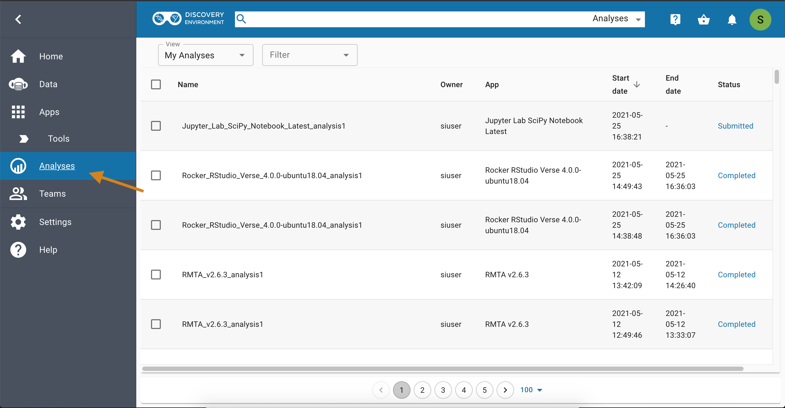
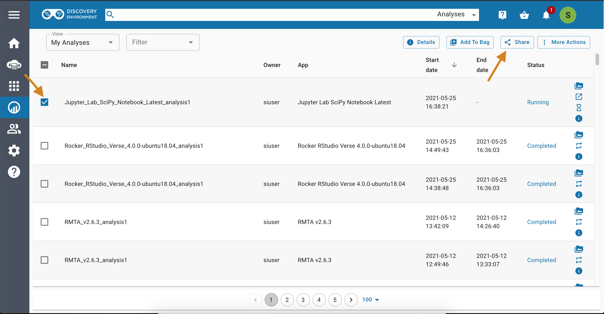
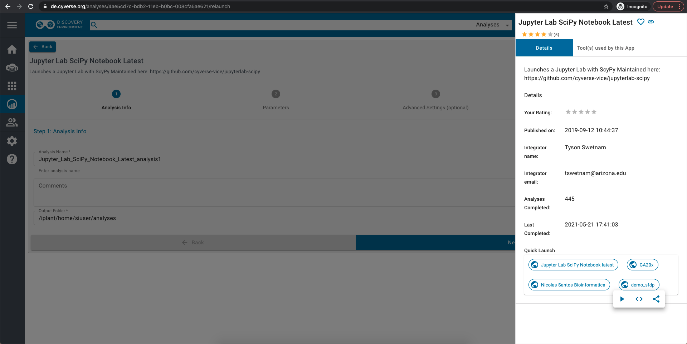

> \<a href=\"<https://atmo.cyverse.org>\"
> target=\"blank\"\>Atmosphere\</a>

> \<a
> href=\"<https://wiki.cyverse.org/wiki/display/atmman/Atmosphere+Manual+Table+of+Contents>\"
> target=\"blank\"\>Atmosphere Manual\</a>

> \<a
> href=\"<https://learning.cyverse.org/projects/atmosphere-guide/en/latest/>\"
> target=\"blank\"\>Atmosphere Guide\</a>

> \<a href=\"<https://bisque.cyverse.org/client_service/>\"
> target=\"blank\"\>BisQue\</a>

> \<a href=\"<https://wiki.cyverse.org/wiki/display/BIS>\"
> target=\"blank\"\>BisQue Manual\</a>

> \<a href=\"<https://user.cyverse.org/>\" target=\"\_blank\"\>CyVerse
> User Portal\</a>

> \<a href=\"<http://learning.cyverse.org>\" target=\"blank\"\>CyVerse
> Learning Center\</a>

> \<a href=\"<https://wiki.cyverse.org>\" target=\"blank\"\>CyVerse
> Wiki\</a>

> \<a href=\"<http://www.cyverse.org/data-store>\"
> target=\"\_blank\"\>Data Store\</a>

> \<a
> href=\"<https://wiki.cyverse.org/wiki/display/DS/Data+Store+Table+of+Contents>\"
> target=\"blank\"\>Data Store Manual\</a>

> \<a
> href=\"<https://learning.cyverse.org/projects/data_store_guide/en/latest/>\"
> target=\"blank\"\>Data Store Guide\</a>

> \<a href=\"<https://de.cyverse.org/de/>\" target=\"blank\"\>Discovery
> Environment\</a>

> \<a
> href=\"<https://wiki.cyverse.org/wiki/display/DEmanual/Table+of+Contents>\"
> target=\"blank\"\>DE Manual\</a>

> \<a
> href=\"<http://learning.cyverse.org/projects/cyverse-discovery-environment-guide/>\"
> target=\"blank\"\>Discovery Environment Guide\</a>

> \<a href=\"<https://dnasubway.cyverse.org/>\" target=\"blank\"\>DNA
> Subway\</a>

> \<a
> href=\"<https://learning.cyverse.org/projects/dnasubway_guide/en/latest/>\"
> target=\"blank\"\>DNA Subway Manual\</a>

> \<a
> href=\"<https://learning.cyverse.org/projects/dnasubway_guide/en/latest/>\"
> target=\"blank\"\>DNA Subway Guide\</a>

> \<a href=\"<https://www.sciapps.org/>\" target=\"blank\"\>SciApps\</a>

> \<a
> href=\"<https://learning.cyverse.org/projects/sciapps_guide/en/latest/>\"
> target=\"blank\"\>SciApps Manual\</a>

> \<a
> href=\"<https://learning.cyverse.org/projects/sciapps_guide/en/latest/>\"
> target=\"blank\"\>SciApps Guide\</a>

> \<a href=\"<https://cyverse-de.github.io/api/>\"
> target=\"blank\"\>Terrain DE API Docs\</a>

> \<a href=\"<https://www.tacc.utexas.edu/tapis>\"
> target=\"blank\"\>Tapis TACC API\</a>

> \<a href=\"<http://ask.iplantcollaborative.org/questions>\"
> target=\"blank\"\>Ask CyVerse\</a>

> \<a href=\"<http://learning.cyverse.org/en/latest/>\"
> target=\"blank\"\>Agave Guide\</a>

> \<a href=\"<http://developer.agaveapi.co/#introduction>\"
> target=\"blank\"\>Agave API\</a>

> \<a href=\"<https://agaveapi.co>\" target=\"blank\"\>Agave Live
> Docs\</a>

> \<a href=\"<http://learning.cyverse.org/en/latest/>\"
> target=\"blank\"\>BisQue Guide\</a>

> \<a
> href=\"<https://github.com/CyVerse-learning-materials/Visual_Interactive_Computing_Environment>\"
> target=\"blank\"\>Github Repo Link\</a>

> \<a href=\"<https://hub.docker.com/u/jupyter>\"
> target=\"blank\"\>Project Jupyter Images\</a>

\_ [Learning Center Home](http://learning.cyverse.org/)

# **Sharing VICE apps with collaborators**

You can share your running VICE workspace with colleagues (with a
CyVerse account) who can see and edit your notebooks, logs, and outputs.

**To share your running workspace**

Click on the Analyses

{width="750px"}

Select the running analysis and click on *Share* from the top bar.

{width="750px"}

From the sharing window, search your collaborators by CyVerse username,
email or group name.

{width="750px"}

**Opening workspaces shared with you**

Click on the Analyses

{width="750px"}

Select the running analysis and click on *Go to analysis* (square arrow
box on right).

{width="750px"}

This will launch the shared analysis in a new window.

{width="750px"}

------------------------------------------------------------------------

There are also different ways to share a VICE app without sharing a
running instance of that app.

-   Apps that have been made public in the Discovery Environment can be
    shared with the [public app\'s
    URL](https://wiki.cyverse.org/wiki/display/DEmanual/Viewing+App+and+Tool+Information).
-   Unpublished apps (those in your private workspace that have not yet
    been made public) can be shared with specific users or teams. See
    [Sharing your App or Workflow and Editing the User
    Manual](https://wiki.cyverse.org/wiki/display/DEmanual/Sharing+your+App+or+Workflow+and+Editing+the+User+Manual#SharingyourApporWorkflowandEditingtheUserManual-Sharingandunsharinganunpublishedapporworkflowwithspecificusers).
-   A Quick Launch configuration can be created, and then the URL to the
    Quick Launch can be shared.

------------------------------------------------------------------------

**Creating and sharing Quick Launch configurations**

Quick Launches provide a way to set default parameter values for an
analysis, which can make it much easier to launch similar jobs without
having to select the parameter values that the jobs have in common for
every new analysis.

To create a Quick Launch, open the app as if you are going to run it,
fill in any default parameters for this Quick Launch, then click the
**Create Quick Launch** button instead of the **Launch Analysis**
button.

{width="640px"}

Then you can name the Quick Launch and make it public.

{width="363px"}

To share the link for a public Quick Launch, or to copy its badge code
for embedding in web pages or in repo markdown files, click the **Quick
Launch** menu item from the app\'s 3-dot menu in the **Apps window**.

{width="585px"}

Note that private Quick Launch configurations cannot be shared, and
clicking on them from this listing simply opens the app launch dialog
with its parameters pre-filled, according to the Quick Launch
configuration.

If you don\'t need to save any default inputs or parameters, you can
also use the app\'s public URL for sharing the VICE app, which acts the
same as a Quick Launch, but it doesn\'t have any parameters pre-filled.

------------------------------------------------------------------------

**Fix or improve this documentation:**

-   On Github:
-   Send feedback: [Tutorials\@CyVerse.org](Tutorials@CyVerse.org)

------------------------------------------------------------------------
