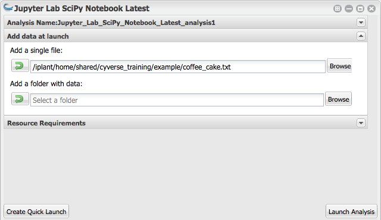
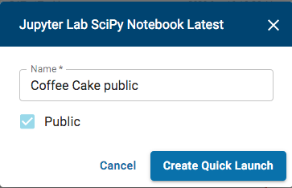
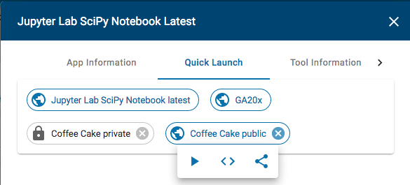

.. include:: ../cyverse_rst_defined_substitutions.txt
.. include:: ../custom_urls.txt

|Home_Icon|_
`Learning Center Home <http://learning.cyverse.org/>`_

**Sharing VICE apps with collaborators**
----------------------------------------

You can share your running VICE workspace with colleagues (with a CyVerse account) who can see and edit your notebooks, logs, and outputs.

**To share your running workspace**

Click on the Analyses

|vice-share-1|

|vice-share-2| 

|vice-share-3|

**Opening workspaces shared with you**

|vice-share-1|

|vice-share-6|

|vice-share-7|

----

There are also different ways to share a VICE app without sharing a running instance of that app.

- Apps that have been made public in the Discovery Environment can be shared with the
  `public app's URL <https://wiki.cyverse.org/wiki/display/DEmanual/Viewing+App+and+Tool+Information>`_.
- Unpublished apps (those in your private workspace that have not yet been made public) can be shared with specific users or teams.
  See `Sharing your App or Workflow and Editing the User Manual <https://wiki.cyverse.org/wiki/display/DEmanual/Sharing+your+App+or+Workflow+and+Editing+the+User+Manual#SharingyourApporWorkflowandEditingtheUserManual-Sharingandunsharinganunpublishedapporworkflowwithspecificusers>`_.
- A Quick Launch configuration can be created, and then the URL to the Quick Launch can be shared.

----

**Creating and sharing Quick Launch configurations**

Quick Launches provide a way to set default parameter values for an analysis,
which can make it much easier to launch similar jobs without having to select the parameter values that the jobs have in common for every new analysis.

To create a Quick Launch, open the app as if you are going to run it,
fill in any default parameters for this Quick Launch,
then click the **Create Quick Launch** button instead of the **Launch Analysis** button.

|quick-launch-create|

Then you can name the Quick Launch and make it public.

|quick-launch-dialog|

To share the link for a public Quick Launch, or to copy its badge code for embedding in web pages or in repo markdown files,
click the **Quick Launch** menu item from the app's 3-dot menu in the **Apps window**.

|quick-launch-use|

Note that private Quick Launch configurations cannot be shared,
and clicking on them from this listing simply opens the app launch dialog with its parameters pre-filled,
according to the Quick Launch configuration.

If you don't need to save any default inputs or parameters,
you can also use the app's public URL for sharing the VICE app,
which acts the same as a Quick Launch,
but it doesn't have any parameters pre-filled.

----

**Fix or improve this documentation:**

- On Github: |Github Repo Link|
- Send feedback: `Tutorials@CyVerse.org <Tutorials@CyVerse.org>`_

----

.. |vice-share-1| image:: ../img/vice-share-1.png
    :width: 750
	
.. |vice-share-2| image:: ../img/vice-share-2.png
    :width: 750
.. |vice-share-3| image:: ../img/vice-share-3.png
    :width: 750
.. |vice-share-4| image:: ../img/vice-share-4.png
    :width: 750
.. |vice-share-5| image:: ../img/vice-share-5.png
    :width: 750
.. |vice-share-6| image:: ../img/vice-share-6.png
    :width: 750
.. |vice-share-7| image:: ../img/vice-share-7.png
    :width: 750

