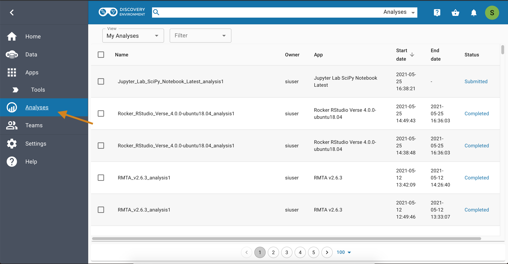
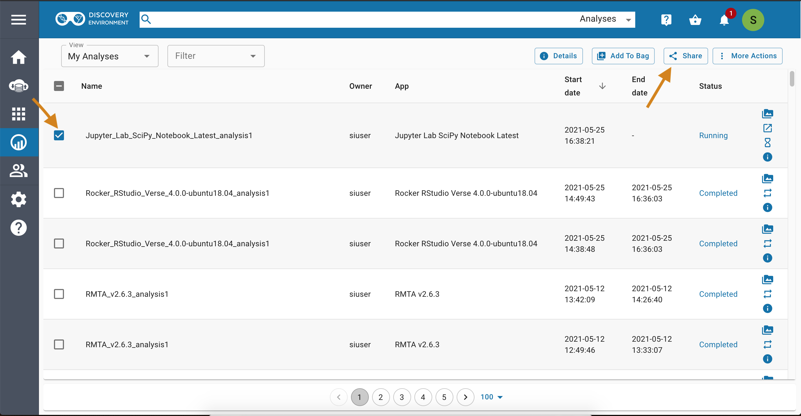
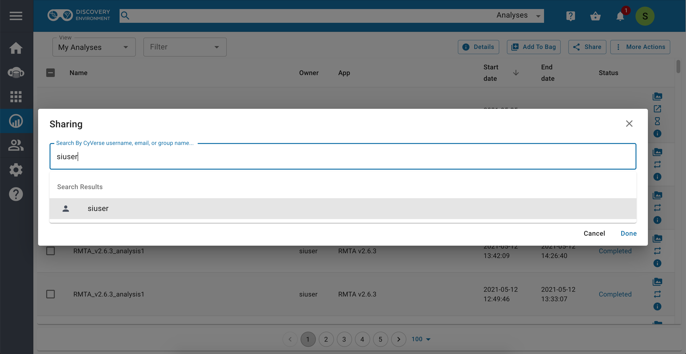
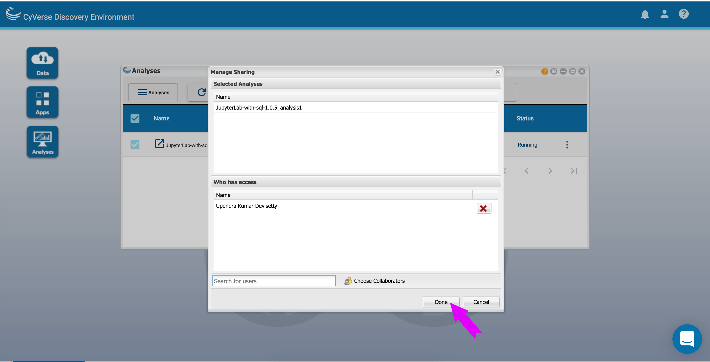
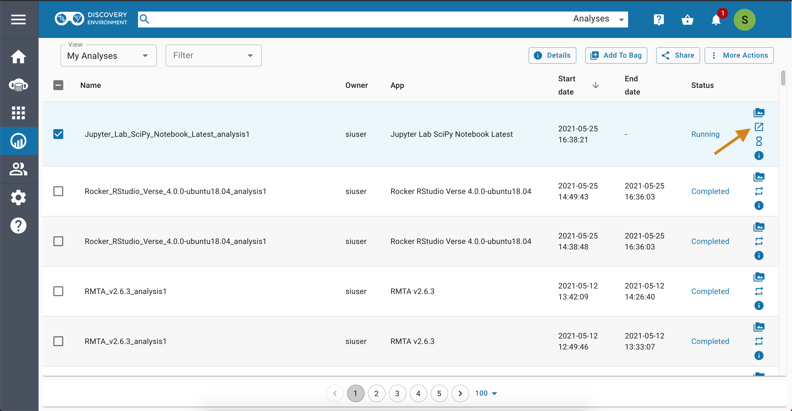
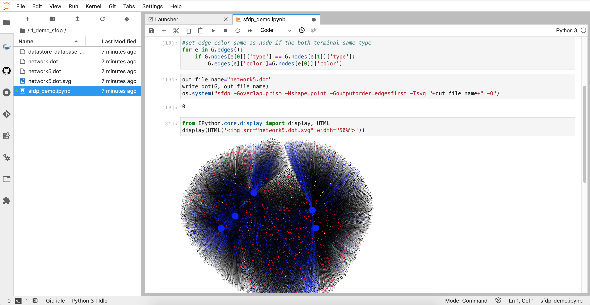

|CyVerse logo|_

|Home_Icon|_
`Learning Center Home <http://learning.cyverse.org/>`_

**Sharing VICE apps with collaborators**
----------------------------------------

You can share your VICE workspace with colleagues (whith a CyVerse account) who can see and edit your notebooks, logs, and outputs. 

**To share your workspace**

|vice-share-1|

|vice-share-2| 

|vice-share-3|

|vice-share-4|

|vice-share-5|

**Opening workspaces shared with you**

|vice-share-1|

|vice-share-6|

|vice-share-7|
----

----

**Fix or improve this documentation:**

- On Github: |Github Repo Link|
- Send feedback: `Tutorials@CyVerse.org <Tutorials@CyVerse.org>`_

----

.. Comment: Place Images Below This Line
   use :width: to give a desired width for your image
   use :height: to give a desired height for your image
   replace the image name/location and URL if hyperlinked

 .. |Clickable hyperlinked image| image:: ./img/IMAGENAME.png
    :width: 500
    :height: 100
 .. _CyVerse logo: http://learning.cyverse.org/

 .. |Static image| image:: ./img/IMAGENAME.png
    :width: 25
    :height: 25

|Home_Icon|_
`Learning Center Home <http://learning.cyverse.org/>`_

.. |CyVerse logo| image:: ../img/cyverse_rgb.png
    :width: 500
    :height: 100
.. _CyVerse logo: http://learning.cyverse.org/
.. |Home_Icon| image:: ../img/homeicon.png
    :width: 25
    :height: 25
.. _Home_Icon: http://learning.cyverse.org/

	

.. |vice-share-4| image:: ../img/vice-share-4.png
    :width: 750

